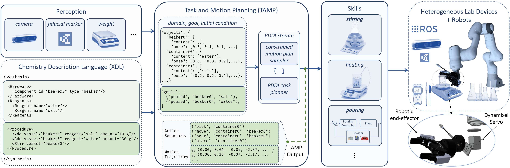

  

**Abstract.** 
In the process of materials discovery, chemists currently need to perform many laborious, time-consuming, and often dangerous lab experiments. 
To accelerate this process, we propose a framework for robots to assist chemists by performing lab experiments autonomously.
The solution allows a general-purpose robot to perform diverse chemistry experiments and efficiently make use of available lab tools.
Our system can load high-level descriptions of chemistry experiments, perceive a dynamic workspace, and autonomously plan the required actions and motions to perform the given chemistry experiments with common tools found in the existing lab environment. Our architecture uses a modified PDDLStream solver for integrated task and constrained motion planning, which generates plans and motions that are guaranteed to be safe by preventing collisions and spillage. We present a modular framework that can scale to many different experiments, actions, and lab tools. In this work, we demonstrate the utility of our framework on three pouring skills and two foundational chemical experiments for materials synthesis: solubility and recrystallization.

## Framework for Robot-assisted Chemical Synthesis

## Video

  <video autoplay width="100%" height="" src="https://user-images.githubusercontent.com/17707730/199334543-3f082b7a-8119-4103-bdc7-9b2b26f1ce06.mp4">

  

